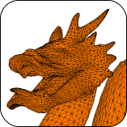

# Flexibility Contact Solver (CoFEBEM/flexcontact)

+ **Package name** (proposal) flexcontact
+ **GitHub:** https://github.com/cofebem
+ **Developers:** V.A. Yastrebov, Y. Boye
+ **License:** BSD 3-Clause License

## Description

This code enables to construct contact problem as an auxiliary problem and solve it as Linear Complementarity Problem using Constrainged Conjugate Gradient method with the matrix accelerated by $\mathcal H$-matrices (hierarchical matrices).

## FEM interfaces

Implemented interface:
- FEniCSx

Potential interfaces:
- **A-set**
- Z-set??
- MFEM
- MOFEM
- Code_Aster
- moose
- dealii
- elemerfem
- Possibly, Abaqus and Ansys?

## Description 

The integration is done via the following steps:
  1. Extract the matrix (linear elastic computations: apply point forces over the nodes of interest and recover the displacement field)
  2. Apply surface forces (to mimic contact problems)

