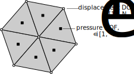
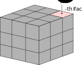

# Flexibility method accelerated by $\mathcal H$-matrices

## Pressure p-0, displacement p-1

### Element formulation 

To be more aligned with the BEM and potentially with the LBB, we can assign pressure degrees of freedom $p_i$ (or tractions $\vec t_i$) to element centers and displacement degrees of freedom $\vec u_j$ to nodes. Then the number of pressure DOFs will be defined by the number of faces and the type of problem $m = d_p \cdot N_{\text{e}}$, where $d_p=1$ for frictionless problems and $d_p=\mathrm{dim}$ for frictional problems. The number of displacement DOFs is given by the dimension and the number of nodes on the surface of interest $n = \mathrm{dim}\cdot N_{n}$.

### Matrix construction

Within this formulation the flexibility matrix $S_c \in \mathbb R^{n\times m}$ is not square. Then the following relation is consistent:
$$
[g]_{n} = [S_c]_{n\times m} [p]_{m} + [g_0]_{n},
$$
where $[p]$ is the array of pressure DOFs, and $[g]$, $[g_0]$ are the arrays of gap and initial gaps defined at nodes.

To construct the matrix $S_c$, we use, for example, the direct sampling method, which consists in applying pressure $p_0$ at individual elements one-by-one and by measuring induced displacement. It is done by solving FE problem:
$$
    [K][u]^i=[f]^i,
$$
where $[f]^i$ represents the right hand side obtained through integration
$$
l(\vec v) = \int\limits_{\text{el}_i} p_0 \vec n\cdot \vec v\,dS,
$$
as shown in the figure below.

The $S_c$'s matrix $i$-th row is then given by 
$$
S_{c_{i,.}} = \frac{1}{p_0}[u]^i.
$$
In practice, PETSc solver allows to assemble all required $[f]^i$ in a single matrix $[F]_{N_{\text{DOF}} \times m}$, where $N_{\text{DOF}}$ is the total number of DOFs of the FE mesh. Then, by solving the following system in batch mode:
$$
[K]_{N_{\text{DOF}} \times N_{\text{DOF}}} [X]_{N_{\text{DOF}} \times m} = \frac{1}{p_0}[F]_{N_{\text{DOF}} \times m},
$$
we obtain directly a matrix $[X]$ whose entries at surface nodes can be easily extracted to obtain $[S_c]_{n \times m}$ matrix.

## Linear Complementarity Problem

Since the displacement resulting from pressures $p$ is given by:
$$
u = S_c p
$$
then the gap $g$ change compared to its initial value is given by:
$$
g = u + g_0 = S_c p + g_0.
$$
The Linear Complementarity Problem (LCP) can be formulated as:
$$
g  = S_c p + g_0
$$
$$
g \ge 0, \quad p \ge 0, \quad g \perp p,
$$
the last condition, called complementarity condition is not easy to verify when $g$ and $p$ are defined on different spaces, i.e. we cannot simply set $p^\top q = 0$.

The associated quadratic programming problem, for the same space for $p$ and $g$ can be defined as
$$
\text{minimize } \mathcal F(p) = \frac 12 p^\top S_c p + p^\top g_0
$$
$$
\text{subject to } p \ge 0
$$
Again, the last term of the functional cannot be readily evaluated if $p$ and $g,g_0$ are defined on different spaces.

However, instead of handling the problem 
$$
g  = S_c p + g_0
$$
we can transform it into
$$
S_c^\top g = S_c^\top S_c p + S_c^\top g_0,
$$
then by denoting 
$$
g' = S_c^\top g, \quad g_0' = S_c^\top g_0,\quad H = S_c^\top S_c,
$$
we get the system
$$
g' = Hp + g_0',
$$
which would result in the quadratic problem:
$$
\text{minimize } \mathcal F(p) = \frac 12 p^\top H p + p^\top g'_0
$$
$$
\text{subject to } p \ge 0
$$

