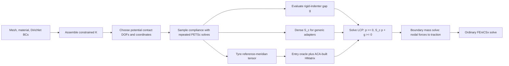

# CoFEBEM architecture

## Purpose

CoFEBEM separates contact resolution from the bulk finite element solver. The
bulk model remains an ordinary constrained linear-elastic problem. CoFEBEM
extracts how a potential contact boundary moves under boundary forces, solves
the unilateral contact conditions using that response, and sends the resulting
traction back to the bulk model.

This is non-intrusive at the formulation level: the finite element code must
provide linear solves and a way to apply/read boundary loads and
displacements, but it does not need to assemble contact constraints or a
contact tangent.

## Mathematical model

Let the constrained finite element system be

\[
K u = f,
\]

and split its free degrees of freedom into volume/non-contact unknowns `v` and
contact unknowns `c`:

\[
\begin{bmatrix}
K_{vv} & K_{vc} \\
K_{cv} & K_{cc}
\end{bmatrix}
\begin{bmatrix}
u_v \\ u_c
\end{bmatrix}
=
\begin{bmatrix}
f_v \\ f_c
\end{bmatrix}.
\]

Eliminating `u_v` gives the condensed contact stiffness

\[
T_c = K_{cc} - K_{cv} K_{vv}^{-1} K_{vc},
\]

and the contact flexibility or compliance

\[
S_c = T_c^{-1}.
\]

Equivalently, column `j` of `S_c` can be sampled by applying a unit contact
force at contact unknown `j`, solving the full constrained system, and reading
the contact displacement response. This repeated-solve route is the active
implementation in `cofebem/contact/Sc.py` and `Sc_normal.py`.

For an undeformed signed gap `g`, the deformed clearance is

\[
w = S_c p + g.
\]

Frictionless unilateral contact imposes

\[
p \ge 0, \qquad w \ge 0, \qquad p^T w = 0.
\]

This is `LCP(S_c, g)`. If `S_c` is symmetric positive definite, it is a
P-matrix and the LCP has a unique solution for every `g`; see `ScSPD.md` for
the argument and the additional issue of preserving positive definiteness
under H-matrix approximation.

The current FEniCSx convention stores `p` as compressive nodal-force
magnitudes. `Contact.fc_to_tc()` solves a boundary mass system with right-hand
side `-p`, producing the negative traction coefficients applied to the elastic
body.

## End-to-end data flow

The tyre branch is direct: it never reconstructs a global dense `S_c` and CCG
uses hierarchical matvecs. The generic `cofebem.fenics.Contact.solve()` adapter
still uses the dense branch.

## Components

### FEniCSx adapters

`cofebem/fenics/contact.py` provides `Contact`, the simplest end-to-end adapter.
Its constructor:

1. identifies contact DOFs;
2. reassembles the matrix and right-hand side held by a DOLFINx
   `LinearProblem`;
3. samples the vertical compliance with `Sc.by_sampling()`;
4. assembles and factorizes the scalar boundary mass matrix.

`solve()` recomputes the indenter gap and solves the LCP. The compliance and
mass matrix remain cached, so moving a rigid indenter can reuse the expensive
sampling. `apply_contact_forces()` transfers the result to the vector traction
function.

`cofebem/fenics/contact_normal.py` provides `Contact_normal`. It projects facet
normals into a CG1 vector space, samples loads and responses along those
normals, and distributes the scalar traction back across x/y/z components. It
is the relevant prototype for curved potential contact surfaces.

Both classes currently use private DOLFINx `LinearProblem` state. That couples
them to a narrow DOLFINx version range and should eventually be replaced by an
explicit adapter protocol.

`cofebem/fenics/dihedral_compliance.py` handles the tyre-specific symmetry
path. Because the tyre revolves about x while road contact acts in global z,
it samples y/z loads and responses at one reference meridian and rotates the
resulting transverse tensor only for entries requested by H-matrix
construction. This reduces full vertical compliance sampling from
`N_theta * N_axial` solves to `2 * N_axial` solves while retaining the correct
fixed road-normal direction and avoiding global dense reconstruction. The inflation-only displacement is added
to the undeformed road gap before solving the LCP, and inflation and contact
loads are superposed in the final elastic solve.

### Compliance construction

`cofebem/contact/Sc.py` samples one global coordinate direction. It factorizes
the PETSc matrix once with a direct KSP and performs one solve per contact
unknown. The current implementation assumes interleaved vector DOFs and is
mainly suitable for the flat, z-normal, serial examples.

`cofebem/contact/Sc_normal.py` accepts contact vertex identifiers and a normal
vector per vertex. For each vertex, it applies a vector load parallel to that
normal, solves, gathers all contact displacement vectors, and projects them
onto their local normals. The result is an `N_c x N_c` scalar normal
compliance.

`Sc.by_schur()` and Schur-complement code in research scripts are prototypes.
They densify the global stiffness matrix and therefore are useful for
cross-checking small systems, not as a scalable production path.

### H-matrices

The maintained H-matrix implementation is under `cofebem/hmatrices/`:

- `ClusterTree` groups contact points recursively by PCA or longest-axis
  splitting.
- `BlockClusterTree` recursively partitions row/column cluster pairs. A block
  is admissible when

  \[
  \max(\operatorname{diam}(t),\operatorname{diam}(s))
  < \eta\,\operatorname{dist}(t,s).
  \]

- Dense inputs support partial ACA, full ACA, ACA+, or truncated SVD.
  `MatrixEntrySource` inputs use partial ACA that requests selected rows and
  columns; near-field leaf blocks request only their local dense entries.
- `HMatrix` provides matvec, dense reconstruction, scalar arithmetic,
  diagnostics, and visualization. Symmetric mode stores one triangle and
  mirrors off-diagonal contributions.

Important current boundaries:

- `HMatrix.from_entry_source(pts, source, ...)` avoids a global dense `A`, but
  its source must answer arbitrary block queries consistently with `pts`.
- `HMatrix.solve()` reconstructs a dense matrix in cluster order and performs
  SciPy LU. Only matvec and storage are hierarchical.
- The tolerance is enforced block-by-block by the selected approximation and
  is not a direct guarantee on global operator error or positive definiteness.

### LCP solvers

There are two solver interfaces during an ongoing migration.

`cofebem/lcp/` is the maintained interface. `LCP` validates `(M, q)`, retaining
a matrix operator without conversion when supplied, and `solve()`
dispatches by method, and every solver returns `LCPResult` with termination
status and feasibility diagnostics. Available methods are PSOR/PGS, NNLS,
Lemke, CCG, and CCG v2. NNLS and CCG are intended for symmetric positive-
definite matrices. CCG and CCG v2 accept symmetric matrix operators; the other
solvers require explicit dense matrices. Lemke may terminate on a secondary
ray.

`cofebem/contact/lcp_solvers/` is the legacy interface still imported by the
FEniCSx adapters and many examples. Its `CCG.solve_hm()` is currently the only
contact-oriented solver path that calls `H @ x`. New solver work should target
`cofebem/lcp`, while adapter migration must preserve force signs and stopping
behavior with regression tests.

### Rigid indenters

`cofebem/bodies/` contains gap functions for spheres, cones, planes, and
experimental cylindrical punches. The flat `Contact` adapter calls
`indenter.gap(points)`. The arbitrary-normal adapter calls
`indenter.new_gap_n(points, normals, ...)`.

Not every body module is import-safe. In particular,
`cylinder_indenter.py` currently loads meshes and arrays and runs a comparison
at module import time. Reusable body models should have no import-time I/O or
solves.

## Complexity and reuse

With `N_c` contact unknowns, dense compliance sampling performs `N_c` solves
after one factorization and stores `N_c^2` entries. Reusing the same compliance
for many indenter positions is therefore important. It is valid only while the
linear operator and the contact unknown set are unchanged.

Rebuild the compliance if any of these change:

- mesh or function-space layout;
- material or tangent stiffness;
- Dirichlet constraints;
- potential contact boundary;
- contact direction or projected normals;
- DOF/coordinate ordering.

Body loads do not change the linear compliance, but their free displacement
contribution must be included in the effective gap for a general loaded
problem. The current minimal path does not implement that general superposition
explicitly.

## Present assumptions and risks

- The active examples are predominantly 3D, vector CG1 and serial.
- Several paths compute global DOFs as `vertex * tdim + component`; this is not
  a general DOLFINx mapping.
- A direct LU PETSc solve is used for compliance sampling.
- `Contact` always uses component 2 and cannot express an arbitrary contact
  normal.
- Private `LinearProblem` members make assembly version-sensitive.
- Generic adapters still store a dense operator before H-matrix compression;
  the dihedral tyre example does not.
- H-matrix approximation is not automatically stabilized to preserve SPD.
- Some research scripts have syntax errors, import-time execution, duplicated
  algorithms, or dependencies on untracked mesh and result files.

These are current-state constraints, not intended design requirements.

## Verification strategy

The dependency-light test suite under `tests/unit_tests/hmatrices` and
`tests/unit_tests/lcp` checks structural invariants, approximation accuracy,
matvecs, dense reconstruction, arithmetic, solver validation, statuses, and
complementarity results. A documentation-time run passed all 276 focused
H-matrix, LCP, and dihedral-compliance tests in `fenicsx-env`.

FEniCSx changes need small end-to-end tests in `fenicsx-env` that additionally
check:

- contact coordinate and DOF ordering;
- symmetry and eigenvalues of sampled `S_c`;
- force/traction sign and units;
- gap, dual feasibility, and complementarity;
- agreement of dense and H-matrix matvec-based contact results;
- behavior on more than one MPI rank before claiming parallel support.
